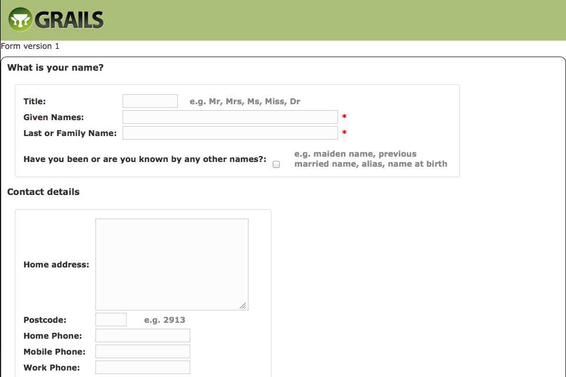
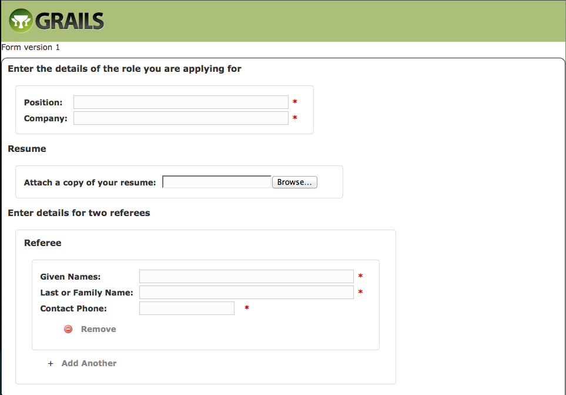

Complex Forms
===

Let's now create a new form that will span several pages.  Add the following to your BootStrap.groovy file:

```groovy
    String jobApplicationDefinition = """
        form {
           question("Job1") {
               "What is your name?" group: "names", {
                   "Title" text: 10, hint: "e.g. Mr, Mrs, Ms, Miss, Dr", suggest: "title"
                   "Given Names" text: 50, required: true
                   "Last or Family Name" text: 50, required: true
                   "Have you been or are you known by any other names?" hint: "e.g. maiden name, previous married name, alias, name at birth", {
                       "List your other names" listOf: "aliases", {
                           "Other name" text: 50
                           "Type of name" text: 40, hint: "e.g maiden name", suggest: "nameType"
                       }
                   }
               }
           }
           question("Job2") {
               "Contact details" group: "contact", {
                   "Home address" text: 200
                   "Postcode" number: 4, hint: "e.g. 2913"
                   "Home Phone" phone: 15
                   "Mobile Phone" phone: 15
                   "Work Phone" phone: 15
               }
           }
           question("Job3") {
              "Education" group: "education", {
                  "University" listOf: "universities", {
                      "Name" text: 20
                      "Years attended" text: 20
                      "Degree" text: 20
                      "Course" text: 20
                  }
                  "High School" listOf: "highSchools", {
                     "Name" text: 20
                     "Years attended" text: 20
                  }
              }
           }

           //role applying for
           question("Job4") {
                "Enter the details of the role you are applying for" group: "role", {
                      "Position" text: 50, required: true
                      "Company" text: 50, required: true
                }
           }
           //include copy of resume
           question("Job5") {
                "Resume" group: "resume", {
                    "Attach a copy of your resume" attachment: "resume_file"
                 }
           }
           //referee details
           question("Job6") {
                "Enter details for two referees" group: "references", {
                      "Referee" listOf: "referee", {
                          "Given Names" text: 50, required: true
                          "Last or Family Name" text: 50, required: true
                          "Contact Phone" phone: 15, required: true
                      }

                }
           }
    }"""
    if (!FormDefinition.get(2)) {
        FormDefinition formDefinition = new FormDefinition(name: 'JobApplication', formDefinition: jobApplicationDefinition, formVersion: 1)
        formDefinition.save()
    }

```

This creates a JobApplication form definition, which contains six questions.

This form adds some extra form elements, notably:

* phone - validates that the entered value conforms to phone number validation rules
* attachment - allows a file to be selected and uploaded as part of the form submission

To configure the questions to span multiple pages, create the following ruleset files in the ~/.OneRing/rules/application directory:

#JobApplication_firstQuestion.ruleset

```groovy
ruleset("JobApplication") {

    abortOnFail = false

    rule("First page of questions") {
        when {
            true
        }
        then {
            next = ['Job1', 'Job2', 'Job3']
        }
    }

}
```

#JobApplicationJob3.ruleset

```groovy
ruleset("JobApplicationJob3") {

    require(['Job1', 'Job2', 'Job3'])  //we need the answers to these questions

    abortOnFail = true

	rule("Second page of job application questions") {
        when {
            true
        }
        then {
            next = ['Job4', 'Job5', 'Job6']
        }
    }

}
```

#JobApplicationJob6.ruleset

```groovy
ruleset("JobApplicationJob6") {

    require(['Job4', 'Job5', 'Job6'])  //we need the answers to these questions

    abortOnFail = true

	rule('finished') {
        when {
            true
        }
        then {
            next = ['End']
        }
    }
}
```

Let's go back to our goodform_tutorial Grails application, and create a new controller for this form.  We do this by running

    grails create-controller JobApplicationForm

from the ~/goodform_tutorial directory.

Update the controller to extend from the com.nerderg.goodForm.FormController class

```groovy
import com.nerderg.goodForm.FormController

class JobApplicationFormController extends FormController {
    def createForm() {
        createForm('JobApplication')
    }
}
```

Once this has been done, run

    grails compile

and go to http://localhost:8080/goodform_tutorial/jobApplication/createForm

This will display the first three questions of the form.



Upon entering the mandatory fields and clicking submit, the second page of form questions will be displayed.



The answers entered on the first page will be listed below the questions.


_Next_: [Customize Form Behaviour](06-CustomizeFormBehaviour.md)

